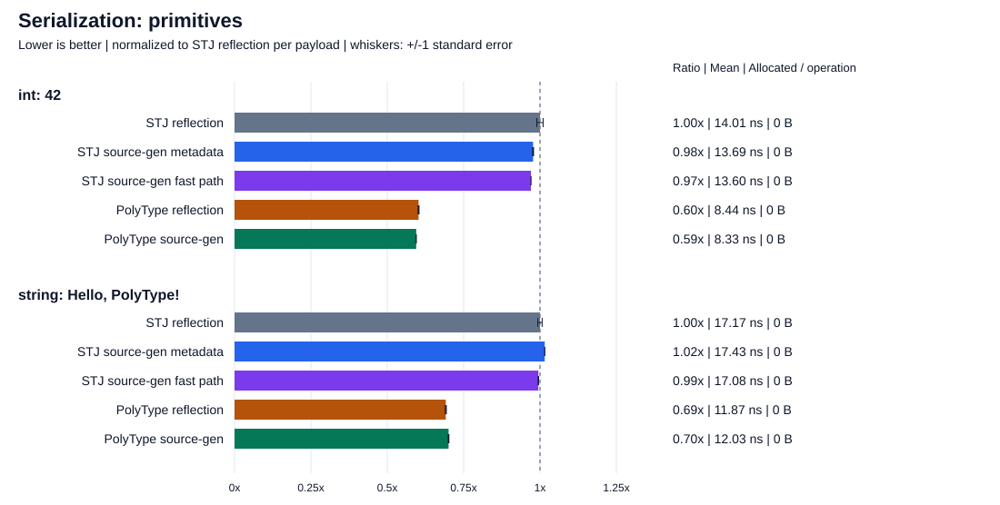
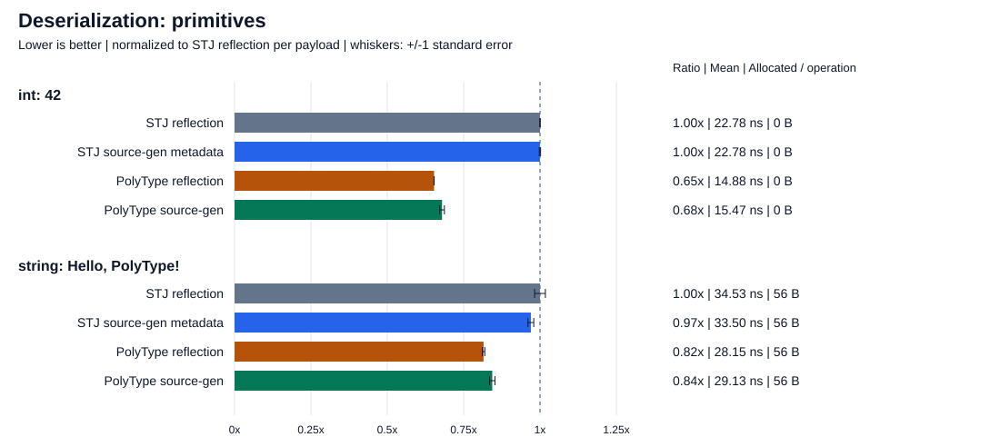
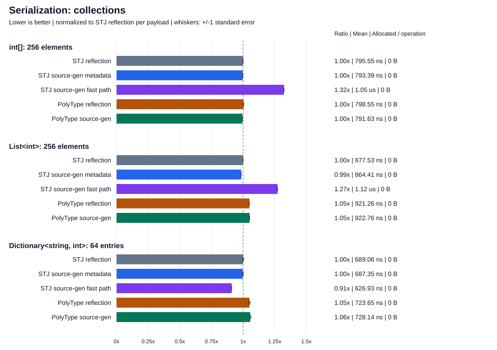
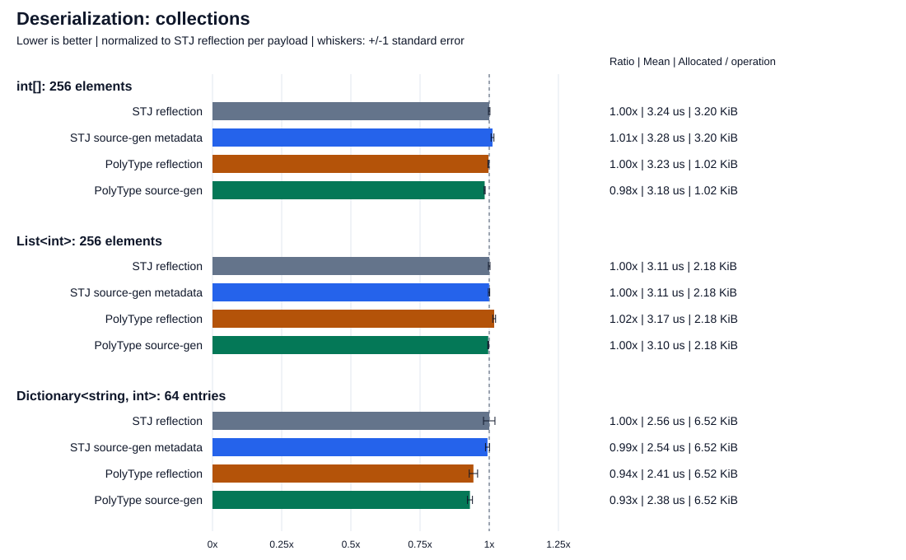
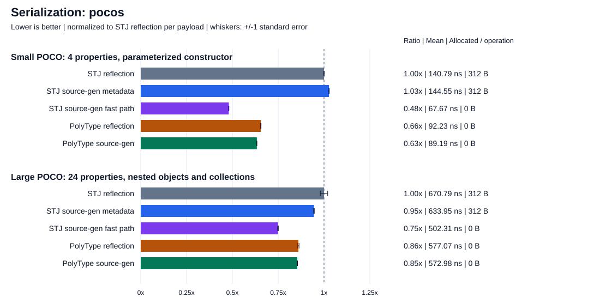
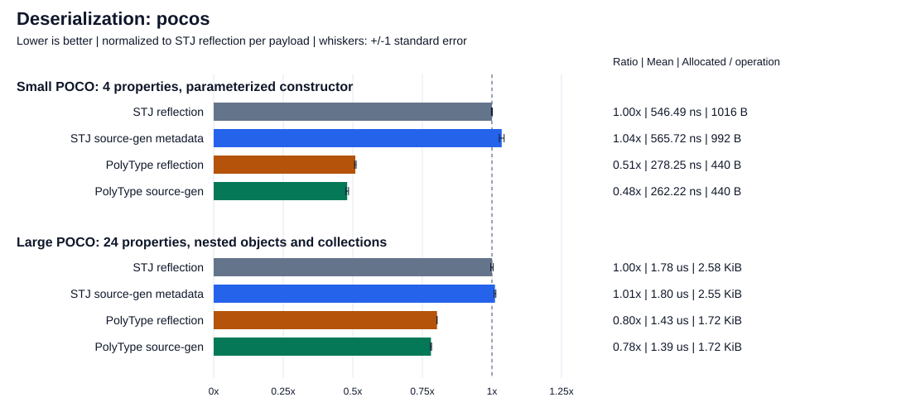
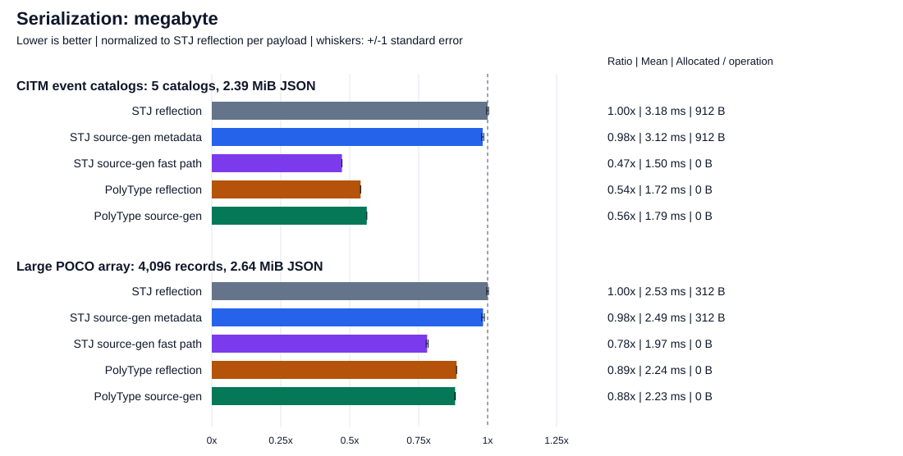
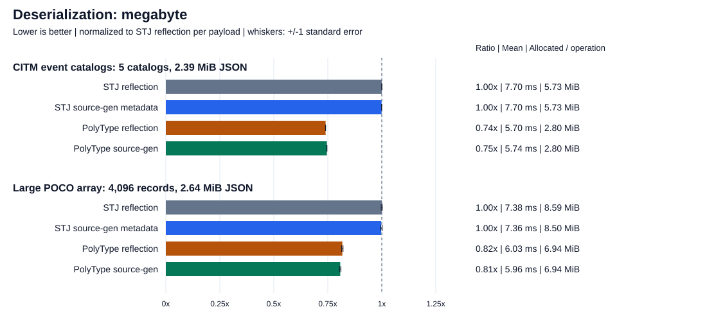

# Performance

## Case study: a JSON serializer

The repository includes a [JSON serializer built on PolyType](https://github.com/eiriktsarpalis/PolyType/tree/main/src/PolyType.Examples/JsonSerializer), using the same `Utf8JsonWriter` and `Utf8JsonReader` primitives as System.Text.Json (STJ). This is a small toy example, not a production serializer: just **2,381 lines of C# source** (including comments and blank lines), demonstrating how little effort is needed to achieve superior performance with PolyType on many of the workloads below, including compared with STJ's metadata serializers. A production-oriented library could achieve even larger performance gains through further specialization and optimization.

The [benchmark suite](https://github.com/eiriktsarpalis/PolyType/blob/main/tests/PolyType.Benchmarks/JsonBenchmark.cs) compares nine payloads, from a single integer to megabytes of JSON. Both serializers use their default JSON settings, cached metadata/converters, and equivalent inputs. Setup checks that every serialization path produces equivalent JSON and that all deserialization paths round-trip correctly.

### Reading the charts

**Shorter bars are better.** Each payload is normalized independently: STJ reflection is **1.00x**, and a 1.20x bar means 20% more elapsed time for that payload. Absolute mean time and managed allocations per operation appear beside every bar. Do not compare the absolute cost of different payloads using bar lengths alone.

Whiskers show **+/- one standard error**, not confidence intervals. Most cases use BenchmarkDotNet **ShortRun** (one launch, three warmup iterations, three measurement iterations). Small-POCO, array, list, and dictionary serialization and both CITM catalog operations use the longer, adaptive **default job**. Small differences are not evidence of a reliable performance gap. The [machine-readable results](../images/performance/results.json) include measurement samples, confidence intervals, allocations, job settings, and environment details.

The comparison includes STJ reflection, STJ source-generated metadata, PolyType reflection, and PolyType source-generated shapes. Serialization also includes STJ's source-generated fast-path context. That context can use built-in converters for types without a generated serialization handler. STJ does not provide an equivalent generated deserialization fast path.

## Primitives

An `int` with value `42` produces 2 bytes of JSON; `"Hello, PolyType!"` produces 18 bytes. These cases emphasize fixed per-call overhead rather than object traversal or collection handling.





## Collections

The `int[]` and `List<int>` each contain integers 0 through 255 (915 bytes of JSON). The `Dictionary<string, int>` contains 64 entries, named `key0` through `key63` (685 bytes). Including both arrays and lists exposes differences in traversal and collection construction that a POCO-only benchmark would miss.





## Small and large POCOs

The small POCO preserves the original benchmark: four properties, a parameterized constructor, a three-element list, and a two-entry dictionary (77 bytes of JSON).

The large POCO has 24 properties: numeric values, booleans, strings, a timestamp, a GUID, arrays, a dictionary, and a nested small POCO (669 bytes). This tests a wider object model, not merely a longer string.





## Megabyte-scale payloads

The **CITM event catalog** is a common JSON benchmark dataset distributed by [nativejson-benchmark](https://github.com/miloyip/nativejson-benchmark/tree/478d5727c2a4048e835a29c65adecc7d795360d5). It contains events, performances, ticket prices, seating categories and areas, topic mappings, nullable fields, and non-ASCII names. The benchmark uses typed POCOs, dictionaries, and nested arrays, not `JsonDocument` or `JsonElement`.

The original file is 1,727,204 bytes including whitespace, but only about 0.5 MB when serialized compactly. To measure a genuinely multi-MB workload, the fixture contains **five independently loaded catalogs**, totaling **2,505,471 UTF-8 bytes** (2.39 MiB). Each catalog contains 184 events and 243 performances, so the batch has 920 events and 1,215 performances plus their nested records. This is a scaled version of the dataset, not the standard single-catalog benchmark.

The pinned dataset is embedded in compressed form with its [MIT license and provenance](https://github.com/eiriktsarpalis/PolyType/blob/e7f8c3750fd2529d3729af86d5639dbccf0fddea/tests/PolyType.Benchmarks/Data/NOTICE.txt). Decompression, loading, and comparison of the complete typed model against the original JSON occur only during setup. The measured deserialization input is compact JSON generated from the batch with the same default escaping settings for all serializers.

A second workload contains **4,096 distinct large POCOs**, totaling **2,763,729 UTF-8 bytes** (2.64 MiB). Both fixtures are checked to exceed 2 MB of serialized JSON before measurement.





For the CITM batch, PolyType serialization takes **1.72-1.79 ms**, compared with **3.12-3.18 ms** for STJ metadata and **1.50 ms** for STJ's fast path. Deserialization takes **5.70-5.74 ms** with PolyType versus **about 7.70 ms** with STJ, with approximately **51% fewer allocated bytes** (2,932,144 versus 6,006,912 bytes per operation).

## Environment and reproduction

Results collected on 2026-10-05 with an Apple M4 Pro (Arm64), macOS 27.0.1 (26A434), BenchmarkDotNet 0.16.0-preview.2, and .NET 11.0.0-rc.1.26425.128, using SDK `11.0.100-rc.1.26425.128` in Release configuration with server GC enabled in the benchmark project.

Serialization writes to a reused `Utf8JsonWriter` backed by an `ArrayBufferWriter<byte>`; buffer and writer reset are included in each operation. It does not allocate a fresh output byte array for each call. Deserialization consumes the same precomputed UTF-8 input for every implementation and includes the allocations needed to construct the result. All metadata/converter creation and equivalence checks happen outside the measured operation.

These measurements exclude startup, Native AOT execution, streaming I/O, dataset loading, and initial output-buffer allocation.

Run the correctness checks and reproduce the charts from the repository root, without other build/test workloads running concurrently:

```bash
dotnet run --project tests/PolyType.Benchmarks -c Release -- --validate-json
dotnet run --project tests/PolyType.Benchmarks -c Release -- \
  --filter '*Json*' --job short --exporters json --artifacts artifacts/json-benchmarks
dotnet run --project tests/PolyType.Benchmarks -c Release -- \
  --filter '*JsonSerializeBenchmark<MyPoco>*' '*JsonSerializeBenchmark<Int32[]>*' '*JsonSerializeBenchmark<List*' \
           '*JsonSerializeBenchmark<Dictionary*' '*Json*Benchmark<CitmCatalog*' \
  --exporters json --artifacts artifacts/json-benchmarks
python3 eng/plot-json-benchmarks.py artifacts/json-benchmarks/results --date 2026-10-05
```

The second benchmark command uses the default job for the six selected suites and overwrites their reports in the same results directory. The plotter uses only Python's standard library and rejects incomplete or duplicate result sets. It writes eight SVG bar charts and a compact JSON export under `docs/images/performance`, and prints every case where a PolyType mean trails its matched STJ configuration or the fastest STJ mean. The printed comparisons include small, potentially noisy differences; they are investigation leads, not significance tests.

To regenerate the charts without running benchmarks:

```bash
python3 eng/plot-json-benchmarks.py docs/images/performance/results.json
```

For investigating a gap, omit `--job short` to use BenchmarkDotNet's longer default job and restrict `--filter` to the relevant generic benchmark type. For example:

```bash
dotnet run --project tests/PolyType.Benchmarks -c Release -- \
  --filter '*Json*Dictionary*' --exporters json --artifacts artifacts/json-dictionary
```

Keep targeted investigation results separate from the complete chart dataset. The plotter requires all nine payloads and all serializer configurations rather than silently publishing missing cases.
